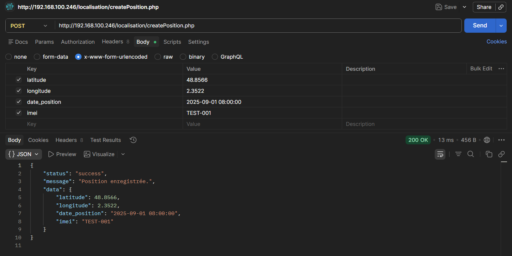

# GeoTracker — Android Location & Server Sync App

<div align="center">


**Application Android de géolocalisation connectée à un backend distant**  
*TP 11 — Localisation d'un smartphone | Bouanani Noussair*

</div>

---

## Table des matières

- [Présentation](#-présentation)
- [Fonctionnalités démontrées](#-fonctionnalités-démontrées)
- [Architecture du projet](#-architecture-du-projet)
- [Technologies utilisées](#-technologies-utilisées)
- [Installation Backend](#-installation-backend)
- [Installation Android](#-installation-android)
- [Structure du projet](#-structure-du-projet)
- [API Reference](#-api-reference)
- [Concepts techniques](#-concepts-techniques)
- [Questions de compréhension](#-questions-de-compréhension)
- [Auteur](#-auteur)

---

## Présentation

**GeoTracker** est une application Android développée dans le cadre du TP 11 du cours de *Programmation Mobile avec Java*. Elle démontre la communication complète entre un appareil Android et un backend distant pour la géolocalisation en temps réel :

```
┌─────────────────────┐        HTTP POST / JSON       ┌─────────────────────┐
│   Android (Java)    │ ─────────────────────────────► │   PHP + MySQL       │
│                     │          Volley 1.2.1          │                     │
│  • LocationManager  │                                │  • createPosition   │
│  • GPS Provider     │   latitude, longitude,         │  • PositionService  │
│  • Permissions GPS  │   date_position, imei          │  • table position   │
└─────────────────────┘                                └─────────────────────┘
```

---

## Fonctionnalités démontrées

| # | Fonctionnalité | Résultat |
|---|---|---|
| 1 | **Détection GPS automatique** | Signal détecté → coordonnées affichées en temps réel |
| 2 | **Envoi automatique** | Chaque nouvelle position envoyée automatiquement au serveur |
| 3 | **Envoi manuel** | Bouton pour forcer l'envoi immédiat |
| 4 | **Statut temps réel** | Point vert/orange/rouge selon l'état du GPS |
| 5 | **Confirmation serveur** | Réponse JSON du PHP affichée dans l'interface |

### Scénario complet (visible dans la vidéo)
1. Lancement de l'application → thème System Dashboard sombre
2. Signal GPS détecté → point vert, coordonnées affichées
3. Envoi automatique → confirmation `✅ Position enregistrée.`
4. Vérification phpMyAdmin → nouvelle ligne dans la table `position`

---

## Architecture du projet

```
LAB20-GeoTracker/
│
├── 📱 app/                              ← Application Android (Java)
│   └── src/main/
│       ├── AndroidManifest.xml          ← Permissions GPS + INTERNET + usesCleartextTraffic
│       ├── java/com/example/localisationsmartphone/
│       │   └── MainActivity.java        ← GPS + Volley POST + Dashboard UI
│       └── res/
│           ├── layout/
│           │   └── activity_main.xml    ← Dashboard complet (5 cartes)
│           ├── drawable/
│           │   ├── bg_card.xml          ← Fond de carte sombre
│           │   ├── bg_button.xml        ← Bouton bleu électrique
│           │   ├── bg_chip.xml          ← Badge provider GPS
│           │   ├── bg_dot_active.xml    ← Point vert (signal actif)
│           │   ├── bg_dot_waiting.xml   ← Point orange (en attente)
│           │   └── bg_dot_error.xml     ← Point rouge (erreur)
│           └── values/
│               ├── colors.xml          ← Palette #121212 + #00E5FF
│               ├── strings.xml         ← Chaînes françaises
│               └── themes.xml          ← Thème System Dashboard
│
├── 🖥️ php-server/                      ← Backend PHP (XAMPP)
│   └── localisation/
│       ├── createPosition.php          ← POST — Endpoint principal
│       ├── init_db.sql                 ← Création BDD + table + données test
│       ├── classe/Position.php         ← Modèle métier
│       ├── connexion/Connexion.php     ← Connexion PDO MySQL
│       ├── dao/IDao.php                ← Interface DAO
│       └── service/PositionService.php ← Logique CRUD
│
└── 📁 docs/
    └── media/
        ├── demo_screenshot.png         ← Capture de l'application
        └── demo_video.mp4              ← Vidéo de démonstration
```

---

## Technologies utilisées

### Côté Android

| Technologie | Version | Rôle |
|---|---|---|
| Java | 11 | Langage principal |
| Android SDK | min 24 / target 36 | API Android |
| Volley | 1.2.1 | Requêtes HTTP POST asynchrones |
| LocationManager | natif Android | Accès au GPS système |
| TelephonyManager | natif Android | Récupération de l'IMEI |
| ActivityResultLauncher | natif Android | Gestion moderne des permissions |
| Material Design 3 | 1.14.0 | Composants UI |

### Côté Backend

| Technologie | Rôle |
|---|---|
| PHP 7.4+ | Langage serveur |
| PDO | Accès base de données sécurisé (requêtes préparées) |
| MySQL / MariaDB | Stockage des positions GPS |
| JSON | Format d'échange de données |
| XAMPP | Serveur local (Apache + MySQL) |

---

## 🖥️ Installation Backend

### Prérequis
- XAMPP installé et démarré (Apache + MySQL)

### Étapes

**1. Déployer le backend**
```
Copier le dossier php-server/localisation/
→ vers C:\xampp\htdocs\localisation\
```

**2. Initialiser la base de données**

Dans **phpMyAdmin → SQL**, exécuter :
```sql
-- Fichier : php-server/localisation/init_db.sql
CREATE DATABASE IF NOT EXISTS localisation
    CHARACTER SET utf8mb4 COLLATE utf8mb4_unicode_ci;

USE localisation;

CREATE TABLE IF NOT EXISTS position (
    id            INT AUTO_INCREMENT PRIMARY KEY,
    latitude      DOUBLE      NOT NULL,
    longitude     DOUBLE      NOT NULL,
    date_position DATETIME    NOT NULL,
    imei          VARCHAR(50) NOT NULL,
    created_at    TIMESTAMP   DEFAULT CURRENT_TIMESTAMP
) ENGINE=InnoDB DEFAULT CHARSET=utf8mb4;
```

**3. Tester l'endpoint**
```
Navigateur : http://192.168.100.246/localisation/createPosition.php
→ Résultat attendu : {"status":"error","message":"Méthode non autorisée."}
(Normal — le GET est refusé, le PHP fonctionne)
```

**4. Tester avec Postman**
```
POST http://192.168.100.246/localisation/createPosition.php
Body → x-www-form-urlencoded :
  latitude      = 48.8566
  longitude     = 2.3522
  date_position = 2025-09-01 08:00:00
  imei          = TEST-001
→ Résultat attendu : {"status":"success","message":"Position enregistrée."}
```

---

## Installation Android

### Prérequis
- Android Studio (Flamingo ou supérieur)
- SDK Android API 24+
- Appareil ou émulateur Android

### Étapes

**1. Ouvrir le projet**
```
File → Open → LAB20-GeoTracker/
```

**2. Configurer l'IP du serveur**

Dans [`MainActivity.java`](app/src/main/java/com/example/localisationsmartphone/MainActivity.java) ligne 47 :
```java
// Appareil physique sur le même WiFi :
private static final String SERVER_URL =
    "http://192.168.100.246/localisation/createPosition.php";

// Émulateur Android Studio :
// Remplacer par : "http://10.0.2.2/localisation/createPosition.php"
```

**3. Gradle Sync**
```
File → Sync Project with Gradle Files
```

**4. Lancer**
```
Run ▶ sur l'appareil cible (téléphone ou émulateur)
Accepter les permissions GPS demandées au démarrage
```

---

## API Reference

### `POST /localisation/createPosition.php`

```json
// Requête (x-www-form-urlencoded)
latitude      = 37.421998
longitude     = -122.084000
date_position = 2026-06-06 13:23:14
imei          = 352099001761481

// Réponse succès (HTTP 201)
{
  "status": "success",
  "message": "Position enregistrée.",
  "data": {
    "latitude": 37.421998,
    "longitude": -122.084,
    "date_position": "2026-06-06 13:23:14",
    "imei": "352099001761481"
  }
}

// Réponse erreur paramètres (HTTP 400)
{ "status": "error", "message": "Paramètres invalides." }

// Réponse méthode non autorisée (HTTP 405)
{ "status": "error", "message": "Méthode non autorisée." }
```

### Structure de la table `position`

```sql
CREATE TABLE position (
    id            INT AUTO_INCREMENT PRIMARY KEY,
    latitude      DOUBLE      NOT NULL,   -- Ex: 37.421998
    longitude     DOUBLE      NOT NULL,   -- Ex: -122.084000
    date_position DATETIME    NOT NULL,   -- Ex: 2026-06-06 13:23:14
    imei          VARCHAR(50) NOT NULL,   -- Identifiant unique du terminal
    created_at    TIMESTAMP DEFAULT CURRENT_TIMESTAMP
);
```

---

## Concepts techniques

### 1. LocationManager — Accès au GPS Android

Android expose le GPS via le service système `LocationManager`.
La méthode `requestLocationUpdates()` configure l'écoute des positions :

```java
LocationManager locationManager =
    (LocationManager) getSystemService(Context.LOCATION_SERVICE);

locationManager.requestLocationUpdates(
    LocationManager.GPS_PROVIDER, // Provider : antenne GPS intégrée
    30_000L,   // minTime : 30 secondes minimum entre deux updates
    50f,       // minDistance : 50 mètres de déplacement minimum
    locationListener
);
```

> **GPS_PROVIDER vs NETWORK_PROVIDER** :  
> GPS = précision maximale (±5m) mais plus lent / consommateur de batterie.  
> NETWORK = utilise le WiFi/4G pour une localisation rapide mais moins précise.

### 2. LocationListener — Réception des positions

```java
private final LocationListener locationListener = new LocationListener() {
    @Override
    public void onLocationChanged(@NonNull Location location) {
        // Appelé à chaque nouvelle position détectée
        double lat = location.getLatitude();
        double lon = location.getLongitude();
        float  acc = location.getAccuracy();   // Précision en mètres
        double alt = location.getAltitude();   // Altitude en mètres

        // Envoi automatique au serveur
        sendPositionToServer();
    }
};
```

### 3. Permissions GPS — API moderne (ActivityResult)

```java
// Déclaration du launcher (avant onCreate)
private final ActivityResultLauncher<String[]> permissionLauncher =
    registerForActivityResult(
        new ActivityResultContracts.RequestMultiplePermissions(),
        grants -> {
            boolean ok = Boolean.TRUE.equals(
                grants.get(Manifest.permission.ACCESS_FINE_LOCATION));
            if (ok) startLocationUpdates();
        }
    );

// Demande de permissions
permissionLauncher.launch(new String[]{
    Manifest.permission.ACCESS_FINE_LOCATION,
    Manifest.permission.ACCESS_COARSE_LOCATION,
    Manifest.permission.READ_PHONE_STATE
});
```

### 4. Volley — Requête HTTP POST asynchrone

```java
StringRequest request = new StringRequest(
    Request.Method.POST,
    SERVER_URL,
    response -> { /* Succès — sur le thread UI */ },
    error   -> { /* Erreur réseau */ }
) {
    @Override
    protected Map<String, String> getParams() {
        // Paramètres du corps POST → reçus via $_POST en PHP
        Map<String, String> params = new HashMap<>();
        params.put("latitude",      String.valueOf(latitude));
        params.put("longitude",     String.valueOf(longitude));
        params.put("date_position", lastDate);
        params.put("imei",          deviceImei);
        return params;
    }
};

Volley.newRequestQueue(getApplicationContext()).add(request);
```

> **Pourquoi Volley et non Retrofit ?**  
> Volley est plus simple pour des requêtes ponctuelles avec des paramètres simples (form-encoded).  
> Retrofit est préférable pour des APIs REST complexes avec sérialisation JSON automatique.

### 5. Sécurité backend — Requêtes préparées PDO

```php
// ❌ DANGEREUX — injection SQL possible
$sql = "INSERT INTO position VALUES ('" . $latitude . "', '" . $longitude . "')";

// ✅ SÉCURISÉ — paramètres liés
$stmt = $pdo->prepare(
    "INSERT INTO position (latitude, longitude, date_position, imei)
     VALUES (:lat, :lon, :date, :imei)"
);
$stmt->execute([
    ':lat'  => floatval($latitude),
    ':lon'  => floatval($longitude),
    ':date' => $datePosition,
    ':imei' => $imei
]);
```

### 6. AndroidManifest — usesCleartextTraffic

```xml
<!-- Autorise les connexions HTTP non chiffrées (serveur local XAMPP) -->
<!-- En production : utiliser HTTPS et retirer cette option -->
<application android:usesCleartextTraffic="true">
```

---

## ❓ Questions de compréhension

| # | Question |
|---|---|
| 1 | Quel est le rôle du `LocationManager` dans Android ? |
| 2 | Quelle différence entre `GPS_PROVIDER` et `NETWORK_PROVIDER` ? |
| 3 | Pourquoi faut-il demander `ACCESS_FINE_LOCATION` à l'exécution (API 23+) ? |
| 4 | Quel est le rôle de `minTime` et `minDistance` dans `requestLocationUpdates()` ? |
| 5 | Pourquoi utiliser Volley plutôt qu'un `HttpURLConnection` direct ? |
| 6 | Quel est le rôle de `usesCleartextTraffic` dans le Manifest ? |
| 7 | Pourquoi stocker `latitude` et `longitude` en `DOUBLE` et non `FLOAT` ? |
| 8 | Quel est l'intérêt des requêtes préparées PDO côté PHP ? |
| 9 | Pourquoi l'IMEI est `unknown` sur un émulateur Android ? |
| 10 | Comment fonctionne `onLocationChanged()` ? Est-il appelé sur le thread principal ? |

---

## Extensions possibles

- [ ] Affichage sur carte (Google Maps API ou OpenStreetMap)
- [ ] Historique des positions dans l'app (liste scrollable)
- [ ] Envoi d'alerte si sortie d'une zone géographique (geofencing)
- [ ] Mode suivi continu avec notification de fond (Foreground Service)
- [ ] Authentification du terminal (token JWT)
- [ ] Stockage local en cache avec Room Database
- [ ] Export CSV des positions
- [ ] Tableau de bord admin web (PHP + JavaScript + Leaflet.js)

---

## Démonstration

### 🎥 Vidéo de démonstration

> La vidéo montre le fonctionnement complet de l'application :
> détection GPS, affichage des coordonnées, envoi au serveur et confirmation en base de données.

https://github.com/user-attachments/assets/demo_video

### 📸 Capture d'écran



---

## 👤 Auteur

**Bouanani Noussair**  
*Cours de Programmation Mobile — Android avec Java*  
*TP 11 — Localisation d'un Smartphone avec GPS et envoi vers un serveur distant*

---

<div align="center">


*Bouanani Noussair — 2026*

</div>
